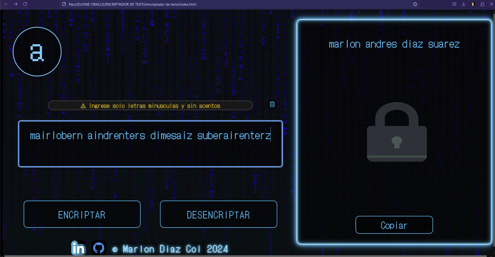

# Encriptador de texto.
Encriptador de texto parte del Challenge Alura ONE Oracle Next Education 27 de Agosto 2024/

## ¡Bienvenidas y bienvenidos a mi encriptador de texto!

A continuación tenemos una aplicación que encripta textos, podrás intercambiar mensajes secretos con otras personas que sepan el secreto de la encriptación utilizada.

Las "llaves" de encriptación que utilizamos son las siguientes:

- La letra "a" es convertida para "ai"
- La letra "e" es convertida para "enter"
- La letra "i" es convertida para "imes"
- La letra "o" es convertida para "ober"
- La letra "u" es convertida para "ufat"

...

Requisitos:

    funcionar solo con letras minúsculas
    No deben ser utilizados letras con acentos ni caracteres especiales
    Debe ser posible convertir una palabra para la versión encriptada también devolver una palabra encriptada para su versión original.

Por ejemplo:

"gato" => "gaitober"
gaitober" => "gato"

